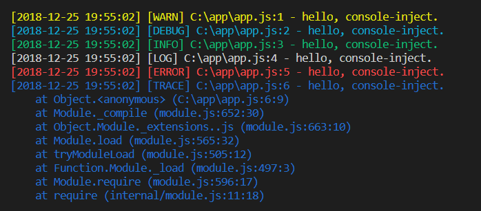

# console-inject
Node.js console 模块。

[](https://www.npmjs.com/package/console-inject)

## 预览


## 起步
```
npm install console-inject --save
```

```
npm install console-inject -g
```

## 使用
从对 `console` 使用场景的实际考虑，console-inject 采用了对原生 `console` 的 `log`、`info`、`warn`、`trace`、`debug`、`error` 方法覆盖重写的技术方案，提供了日志的时间戳、文件路径、代码行号、类型颜色等特性，所以只需在程序入口引入即可注入：

```javascript
require('console-inject');
```

当然，你也可以通过命令进行注入，它支持诸如 `node`、`nodemon` 等各种 Node.js 应用启动器，无需改动代码即可享受 console-inject 带来的特性：

```
console-inject node app.js
```
